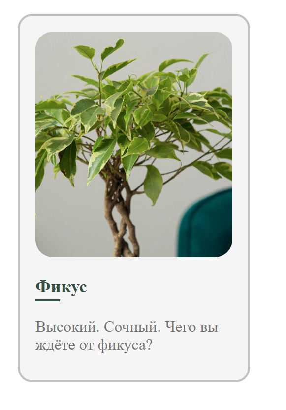

# Контрольная работа №1. Жулева Дарья
## Практическая работа №1
*Ответ на задание хранится в папке "1"*

Для просмотра откройте файл ["card_sass.html"](./1/card_sass.html) в браузере. Внешний вид:



## Практическа работа 2 и 3
*Ответ на задание хранится в папке "2-3"*

Требуемое API реализовано в файле ["server.js"](./2-3/server.js). Скрины проверки API из 2 практики и запросов из открытого API в Postman хранятся в папке "screen Postman"

## Практическая работа 4 и 5
*Ответ на задание хранится в папке "4-5"*

Для запуска необходимо открыть два терминала. В одном выполнить команды:
```
cd 4-5\server
npm install
npm start
```
Во втором команды:
```
cd 4-5\online-store
npm install
npm start
```
После выполнения команд:
* Swagger документация: http://localhost:3000/api-docs/
* Сайт: http://localhost:3001/

Скрины работающего swagger также можно увидеть в папке 4-5/скрины swagger